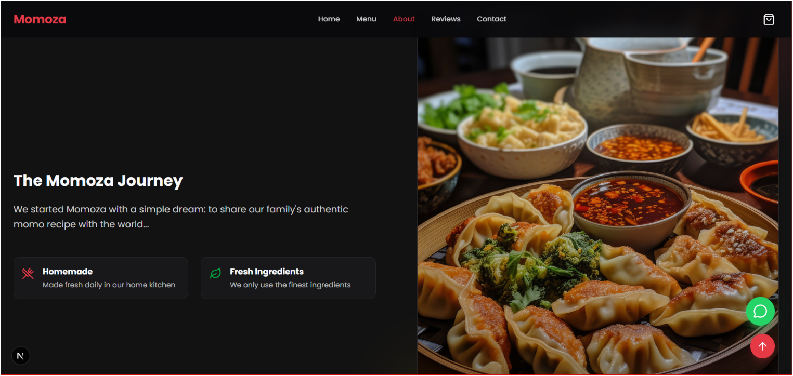
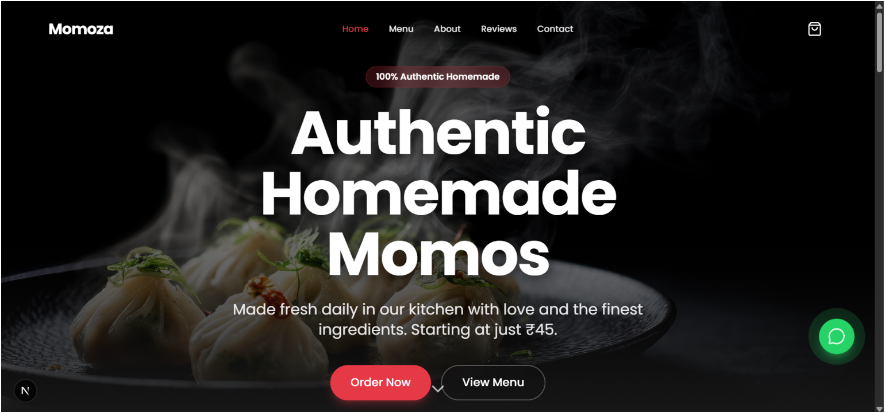
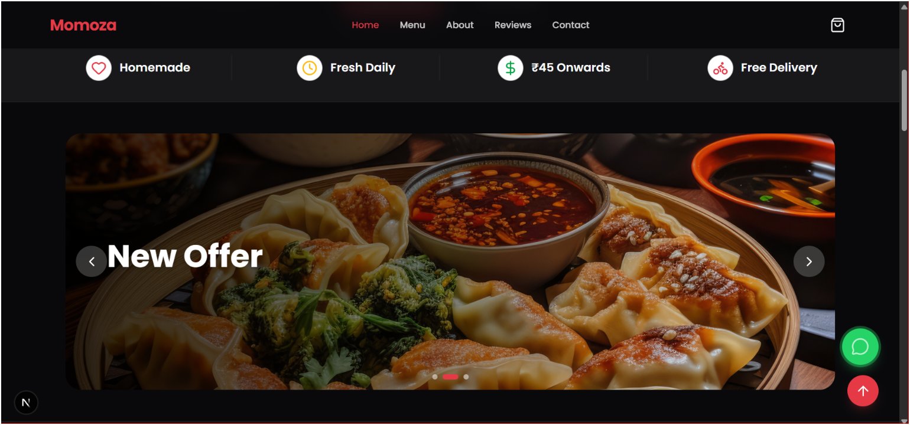
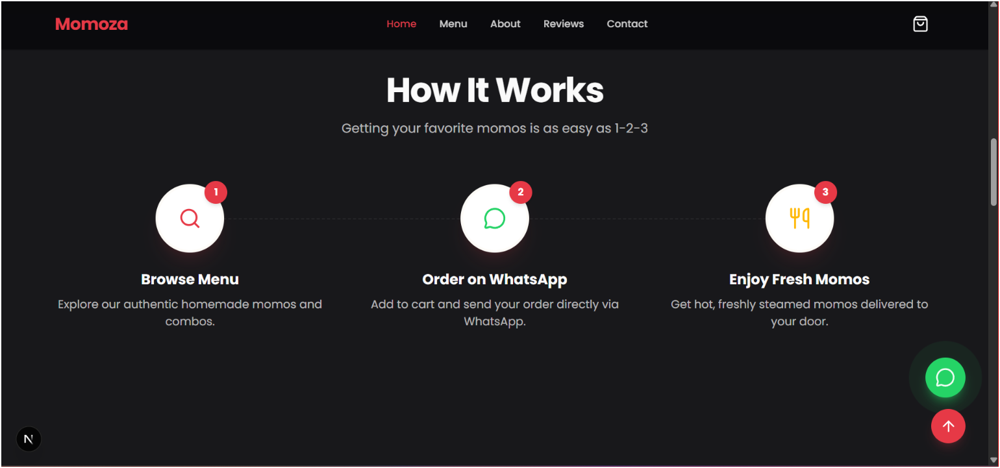
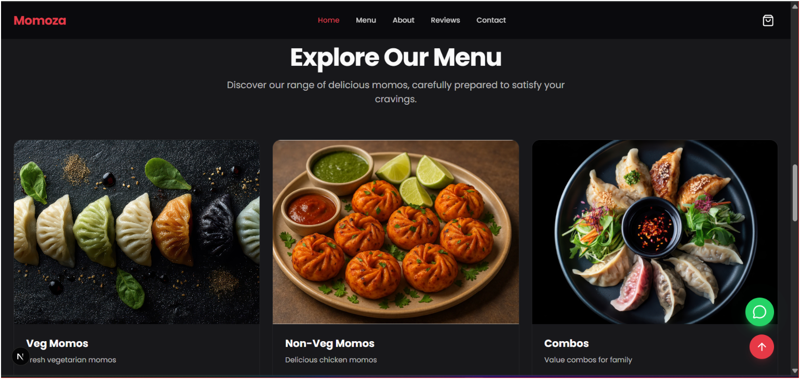
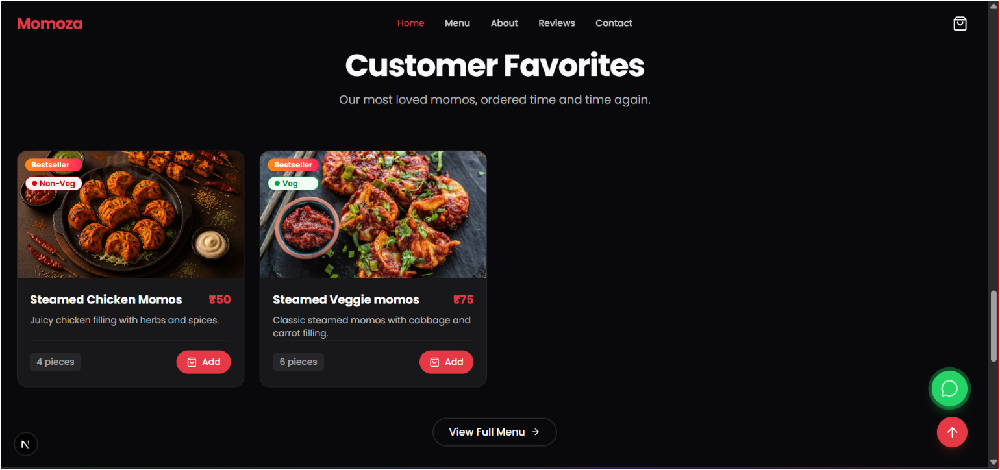
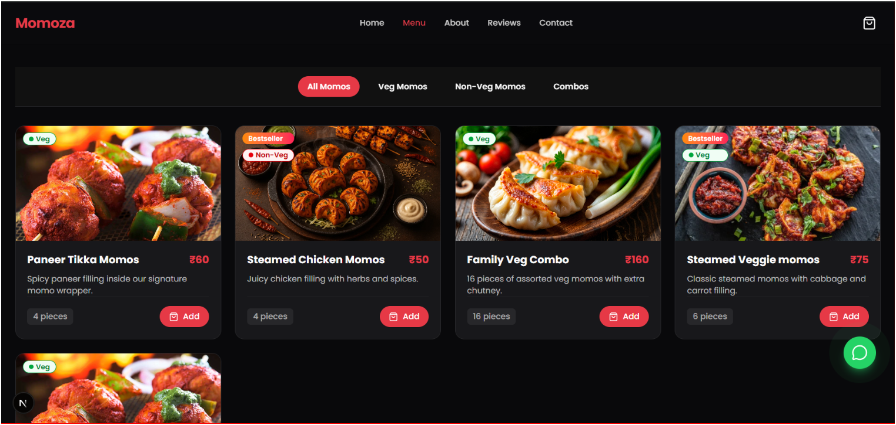

<div align="center">
  
  <h1>🥟 Momoza</h1>
  <p><strong>A complete digital ordering system and website for authentic homemade momos.</strong></p>

  [](https://nextjs.org/)
  [](https://tailwindcss.com/)
  [](https://supabase.com/)
  [](https://www.typescriptlang.org/)

  <br />
</div>

## 🌟 Overview

Momoza is a full-stack, end-to-end food ordering platform built for high performance and seamless user experience. It features a beautiful, dynamic frontend for customers to browse the menu and place orders, and a secure backend admin panel for managing the store, menu items, and incoming orders.

### 📸 Application Previews
*(Screenshots showcasing the Momoza platform)*

<div align="center">
  
  
  <p float="left">
    
    
  </p>

  <p float="left">
    
    
  </p>

  <p float="left">
    
    
  </p>
</div>

## 🚀 Features
- **Instant Page Loads**: Parallel data fetching with graceful fallbacks.
- **Dynamic Cart & Checkout**: Real-time order calculation and tracking.
- **Admin Dashboard**: Full CRUD management of Menu, Categories, and Orders.
- **Row Level Security (RLS)**: Highly secure Postgres database via Supabase.
- **Responsive Design**: Tailored for both desktop and mobile users.

## 🛠️ Tech Stack
- **Framework:** Next.js 15 (App Router)
- **Language:** TypeScript
- **Styling:** Tailwind CSS v4 & Framer Motion
- **Database/Auth:** Supabase (PostgreSQL)
- **Hosting:** Vercel

---

## 💻 Local Setup Instructions

Follow these steps to run Momoza locally on your machine.

### 1. Install Dependencies
```bash
npm install
```

### 2. Environment Variables
Copy the `.env.local` placeholders and fill them in with your Supabase credentials:

```bash
# Supabase Configuration
NEXT_PUBLIC_SUPABASE_URL=https://<your-project-id>.supabase.co
NEXT_PUBLIC_SUPABASE_ANON_KEY=eyJhbG...<your-long-anon-key>...
SUPABASE_SERVICE_ROLE_KEY=eyJhbG...<your-long-service-key>...
```

### 3. Database Initialization
1. Navigate to your [Supabase Dashboard](https://supabase.com/dashboard).
2. Open the **SQL Editor**.
3. Copy the entire contents of `supabase/seed.sql` and run it in the editor to instantly create tables, policies, and seed data.

### 4. Run the Development Server
```bash
npm run dev
```
Open [http://localhost:3000](http://localhost:3000) in your browser to see the result.

---

## 📁 Project Structure

- `src/app` - Next.js App Router pages and API endpoints.
- `src/components/public` - Customer-facing UI components.
- `src/components/admin` - Admin dashboard specific components.
- `src/lib` - Supabase client configurations and utilities.
- `src/hooks` - Custom React hooks (e.g., Cart Context).
- `supabase/` - Database SQL scripts and seed data.
- `docs/` - Project documentation and application screenshots (`docs/images/`).

---

<div align="center">
  <h3>Built by Farhan Sayed</h3>
  <p>AI & Full Stack Engineer specializing in modern scalable systems.</p>
  <p>
    🌐 <a href="https://farhanbuilds.in">farhanbuilds.in</a> | 
    ✉️ <a href="mailto:farhanbuilds16@gmail.com">farhanbuilds16@gmail.com</a> | 
    🐙 <a href="https://github.com/FarhanSayed16">GitHub</a>
  </p>
</div>
